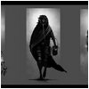

## IMG vs. CSS background-image

设置图片的宽度、高度,图片显示的时候不拉伸<br/>


比如上面这张图,显示为100px*100px,不拉伸:<br/>


> ``标签下可以使用css的`object-fit`属性

```html

<style>
.cover {
  object-fit: cover;
  width: 100px;
  height: 100px;
}
</style>
```

> 用`background-image`方式添加图片的话,可以把`background-size`设置为`cover`

```html
<div class="container"></div>​
<style>
.container {
    width: 100px;
    height: 100px;
    background-image: url("yourpath/1.jpg");
    background-size: cover;
    background-repeat: no-repeat;
    background-position: 50% 50%;
}​
</style>
```

> IE8及以下，请使用[filter属性](http://blog.sina.com.cn/s/blog_6a53fce50102vhqr.html)

```html
<div class="container"></div>​
<style>
.container {
    width: 100px;
    height: 100px;
    /*用filter的时候需要注意一下IE8不能识别相对路径*/
    filter:progid:DXImageTransform.Microsoft.AlphaImageLoader(enabled=true, sizingMethod=scale, src='yourpath/1.jpg');
    background-repeat: no-repeat;
}​
</style>
```
+ [CSS-TRICKS的filter使用大全](https://css-tricks.com/almanac/properties/f/filter/)
+ [IE中CSS-filter滤镜小知识大全](https://segmentfault.com/a/1190000002433305)


## 何时需要使用img标签添加图片

+ 打印页面的时候默认包含的图片
+ 当图像无法加载显示的时候，用户可以看到文本解释，使用`alt`属性添加文本

## 何时使用background-image属性添加图片

+ 打印页面的时候默认不包含的图片

[IMG vs. CSS background-image](https://stackoverflow.com/questions/492809/when-to-use-img-vs-css-background-image/1469139#1469139)

